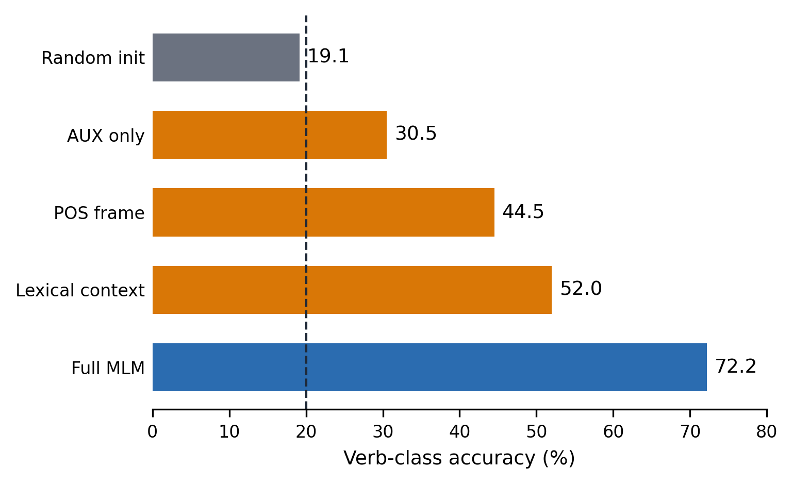

# Auxiliary cues and novel verb-class learning

Research materials for the ACL-format course paper **“Are Auxiliary Cues
Uniquely Informative for Coarse Verb-Class Learning in Masked Language Models
Trained on CHILDES?”**

[Read the paper](output/pdf/paper.pdf)

The study asks whether English auxiliary identity contributes uniquely to
coarse verb-class expectations in small masked language models trained from
scratch on child-directed speech. The matched-control experiments support a
narrow conclusion: auxiliary information is useful within a redundant
distributional system, but the evidence does not establish an AUX-specific
effect.



## Main results

- Five-way verb-class accuracy rises from **53.7%** at 720k training tokens to
  **72.2%** at the full training scale.
- Leakage-controlled accuracies are **30.5%** for AUX-only Naive Bayes,
  **44.5%** for local POS frames, and **52.0%** for lexical context.
- AUX-identity ablation lowers five-seed class preference by **0.144** relative
  to unmodified input, but not reliably more than both matched-damage controls.
- In the nonce experiment, shuffling AUX identities lowers cross-template
  accuracy by **3.27 percentage points** and class preference by **0.096**.

## Repository structure

| Path | Purpose |
|---|---|
| `configs/` | Frozen data, model, intervention, seed, and evaluation settings |
| `src/` | Preprocessing, training, evaluation, and statistical implementation |
| `scripts/` | Short entry points for the two main experiment pipelines |
| `data/README.md` | Data provenance, acquisition, preprocessing, and privacy limits |
| `results/` | Release-safe aggregate values underlying the paper |
| `figures/` | Final figures used by the manuscript |
| `paper/` | ACL LaTeX source, bibliography, style files, and generated tables |
| `output/pdf/` | Compiled manuscript |

The division is intentional: **configs describe what is run, source files
implement it, and scripts provide one-command entry points.**

## Environment

The reference environment is Python 3.11:

```bash
python3.11 -m venv .venv
source .venv/bin/activate
python -m pip install -r requirements.txt
```

The POS annotation reported in the paper uses spaCy 3.4.4 with
`en_core_web_sm` 3.4.1.

## Data preparation

The source is the CHILDES component of
[BabyLM 2026 Strict](https://huggingface.co/datasets/BabyLM-community/BabyLM-2026-Strict).
Obtain it independently, keep it outside Git, and then run:

```bash
python src/preprocess_childes.py \
  /path/to/childes.train.txt data/expanded_childes
python src/annotate_pos.py \
  data/expanded_childes/childes_train2_cds_full_cleaned.txt \
  data/expanded_childes/pos/childes_train2_cds_full_spacy_pos.txt
```

See [`data/README.md`](data/README.md) for the exact source hash, selection
rules, split sizes, and applicable TalkBank restrictions.

## Run the experiments

Natural-corpus training, ablations, evaluation, and summary:

```bash
bash scripts/run_natural_corpus.sh
```

Nonce transfer, starting from the Original checkpoints for seeds 2026--2028:

```bash
bash scripts/run_nonce.sh
```

The frozen settings are [`configs/natural_corpus.yaml`](configs/natural_corpus.yaml)
and [`configs/nonce.yaml`](configs/nonce.yaml). Full retraining is
compute-intensive; checkpoints and logs are generated locally and are not
versioned.

## Results and traceability

| Paper evidence | Released source |
|---|---|
| Natural-corpus means and seed variability | `results/natural_corpus/metrics_summary.csv` |
| Natural-corpus confidence intervals | `results/natural_corpus/confirmatory_hierarchical_bootstrap.csv` |
| AUX-specificity decision | `results/natural_corpus/CONFIRMATORY_DECISION.json` |
| Nonce means and confidence intervals | `results/nonce/` |
| Learning curve, baselines, random initialization, correlations | `results/statistics/` |

Recompute the headline numbers from these aggregates with:

```bash
python3 scripts/verify_results.py
```

The repository does not include the licensed corpus, derived utterance text,
per-example predictions, evaluation contexts, tokenizers, model checkpoints,
or training logs. Aggregate values can be verified directly; recomputing
confidence intervals or models requires regenerating the excluded local
intermediates.

## Citation and license

Citation metadata are in [`CITATION.cff`](CITATION.cff). Original code is
licensed under MIT; original documentation, aggregate results, and figures are
licensed under CC BY 4.0. The manuscript, ACL style files, and upstream
datasets retain the separate terms described in [`LICENSE`](LICENSE).
